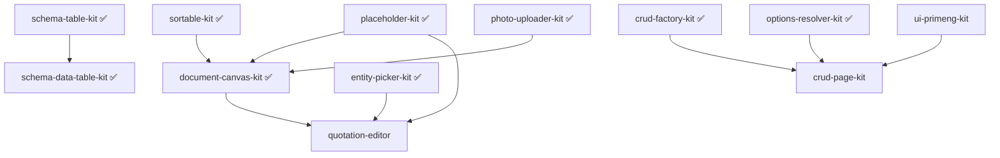

# KITS Readiness Checklist — Maximum Readiness (Level 3)

**Level 3** = working `src/` code + hub demo page + vitest green + STATUS ✅

Last updated: 2026-05-30

---

## Definition of Done (Maximum Readiness)

| # | Criterion | Description |
|---|-----------|-------------|
| 1 | Real `src/` | No `export {}` stubs; portable code copied/adapted from KPPDF (zero imports from kppdf-3.0) |
| 2 | `provide*Kit()` | Angular DI provider (or Express factory for pattern C) where applicable |
| 3 | Hub demo | Page in `schema-table-kit/demo/pages/<kit-id>/` |
| 4 | Route | Entry in `schema-table-kit/demo/app.routes.ts` |
| 5 | `hasDemo: true` | In `schema-table-kit/demo/modules.config.ts` |
| 6 | Tests | `npm test` green in `schema-table-kit` |
| 7 | STATUS.md | Updated to ✅ v0.1+ with Done/Next sections |
| 8 | Docs | COPY-GUIDE + QUICKSTART accurate for current API |

**Readiness labels:** ✅ ready · 🟡 stub demo · 📋 scaffold · 📄 doc-only

---

## Global Monorepo Items

| # | Item | Status | Notes |
|---|------|--------|-------|
| G1 | Hub app `schema-table-kit` runs (`ng serve demo`) | ✅ | |
| G2 | `tsconfig.json` path aliases for ported kits | ✅ | 9 kits wired |
| G3 | `tsconfig.demo.json` includes sibling kit `src/` | ✅ | |
| G4 | `vitest.config.ts` aliases for kit core | ✅ | |
| G5 | Shared `node_modules` via hub | ✅ | |
| G6 | Home hub reflects `hasDemo` | ✅ | |
| G7 | Root `README.md` catalog matches STATUS | ✅ | Updated 2026-05-30 |
| G8 | `tools/scaffold-kits.mjs` | ✅ | |
| G9 | CI: `npm test && npm run build` | ☐ | |

---

## Recommended Execution Order (Dependency Graph)



**Wave 3 (next):** ui-primeng-kit → crud-page-kit → quotation-editor

---

## Summary Matrix

| Kit | Status | P | Size | Demo | Tests |
|-----|--------|---|------|------|-------|
| schema-table-kit | ✅ v1 | P0 | — | ✅ | ✅ |
| schema-data-table-kit | ✅ v0.1 | P1 | M | ✅ | ✅ |
| entity-picker-kit | ✅ v0.1 | P1 | L | ✅ | 🟡 |
| sortable-kit | ✅ v0.1 | P1 | S | ✅ | ✅ |
| options-resolver-kit | ✅ v0.1 | P1 | M | ✅ | ✅ |
| crud-factory-kit | ✅ v0.1 | P1 | M | ✅ | ✅ |
| photo-uploader-kit | ✅ v0.1 | P1 | M | ✅ | ✅ |
| placeholder-kit | ✅ v0.1 | P1 | M | ✅ | ✅ |
| document-canvas-kit | ✅ v0.1 | P1 | XL | ✅ | ✅ |
| crud-page-kit | 📋 | P2 | XL | ☐ | ☐ |
| ui-primeng-kit | 📋 | P2 | XL | ☐ | ☐ |
| auth-rbac-kit | 📋 | P3 | L | ☐ | ☐ |
| eav-kit | 📋 | P3 | L | ☐ | ☐ |
| quotation-editor | 📋 | P0 | XL | ☐ | ☐ |
| layout-shell-kit | 📋 | P3 | L | ☐ | ☐ |

**Level 3 count:** 9/15 ready

---

## Per-Kit Checklists

### 1. schema-table-kit — ✅ P0 · Reference

**KPPDF:** `kppdf-3.0/src/app/shared/schema-table/`, `backend/.../schema-tables/` · **Deps:** —

| Real src | provide* | Demo | Route | hasDemo | Tests | STATUS | Docs |
|----------|----------|------|-------|---------|-------|--------|------|
| ✅ | ✅ | ✅ | ✅ | ✅ | ✅ | ✅ | ✅ |

---

### 2. schema-data-table-kit — ✅ P1 · M

**KPPDF:** inline `kp-table` · **Deps:** schema-table-kit

| Real src | provide* | Demo | Route | hasDemo | Tests | STATUS | Docs |
|----------|----------|------|-------|---------|-------|--------|------|
| ✅ | ✅ | ✅ | ✅ | ✅ | ✅ | ✅ | 🟡 |

---

### 3. entity-picker-kit — ✅ P1 · L

**KPPDF:** `kppdf-3.0/src/app/shared/ui/kp-product-picker/` · **Deps:** schema-table-kit

| Real src | provide* | Demo | Route | hasDemo | Tests | STATUS | Docs |
|----------|----------|------|-------|---------|-------|--------|------|
| ✅ | ✅ | ✅ | ✅ | ✅ | 🟡 | ✅ | 🟡 |

---

### 4. sortable-kit — ✅ P1 · S

**KPPDF:** `kppdf-3.0/src/app/shared/ui/kp-sortable/` · **Deps:** @angular/cdk

| Real src | provide* | Demo | Route | hasDemo | Tests | STATUS | Docs |
|----------|----------|------|-------|---------|-------|--------|------|
| ✅ | — | ✅ | ✅ | ✅ | ✅ | ✅ | 🟡 |

---

### 5. options-resolver-kit — ✅ P1 · M

**KPPDF:** `kppdf-3.0/src/app/shared/services/*-options.service.ts` · **Deps:** —

| Real src | provide* | Demo | Route | hasDemo | Tests | STATUS | Docs |
|----------|----------|------|-------|---------|-------|--------|------|
| ✅ | ✅ | ✅ | ✅ | ✅ | ✅ | ✅ | 🟡 |

---

### 6. crud-factory-kit — ✅ P1 · M

**KPPDF:** `kppdf-3.0/backend/src/utils/crud-factory.ts` · **Deps:** Express peers

| Real src | provide* | Demo | Route | hasDemo | Tests | STATUS | Docs |
|----------|----------|------|-------|---------|-------|--------|------|
| ✅ | ✅ | ✅ | ✅ | ✅ | ✅ | ✅ | 🟡 |

---

### 7. photo-uploader-kit — ✅ P1 · M *(Phase 2 — done)*

**KPPDF:** `kppdf-3.0/src/app/shared/ui/kp-photo-uploader.component.ts` · **Deps:** — (plain HTML v0.1)

| Real src | provide* | Demo | Route | hasDemo | Tests | STATUS | Docs |
|----------|----------|------|-------|---------|-------|--------|------|
| ✅ | ✅ | ✅ | ✅ | ✅ | ✅ | ✅ | 🟡 |

**Blockers:** none · **Next:** server upload hook, ui-primeng skin

---

### 8. placeholder-kit — ✅ P1 · M *(Phase 2 — done)*

**KPPDF:** `kppdf-3.0/src/app/shared/placeholder/`, `kp-placeholder-picker/` · **Deps:** —

| Real src | provide* | Demo | Route | hasDemo | Tests | STATUS | Docs |
|----------|----------|------|-------|---------|-------|--------|------|
| ✅ | ✅ | ✅ | ✅ | ✅ | ✅ | ✅ | 🟡 |

**Blockers:** none · **Next:** full registry, `resolveDocumentBlock()`

---

### 9. document-canvas-kit — ✅ P0.1 · M/XL *(Phase 2 — done)*

**KPPDF:** `kppdf-3.0/src/app/shared/ui/kp-document-block-editor/` · **Deps:** sortable-kit ✅, placeholder-kit ✅

| Real src | provide* | Demo | Route | hasDemo | Tests | STATUS | Docs |
|----------|----------|------|-------|---------|-------|--------|------|
| ✅ | ✅ | ✅ | ✅ | ✅ | ✅ | ✅ | 🟡 |

**Blockers:** none for v0.1 · **Next:** table/separator blocks, background, text-block-edit dialog

---

### 10. crud-page-kit — 📋 P2 · XL

**KPPDF:** `kppdf-3.0/src/app/shared/crud/kp-crud-page/` · **Deps:** crud-factory, options-resolver, ui-primeng, schema-data-table

| Real src | provide* | Demo | Route | hasDemo | Tests | STATUS | Docs |
|----------|----------|------|-------|---------|-------|--------|------|
| ☐ | ☐ | ☐ | 🟡 | ☐ | ☐ | ☐ | 📋 |

**Blockers:** ui-primeng-kit

---

### 11. ui-primeng-kit — 📋 P2 · XL

**KPPDF:** `kppdf-3.0/src/app/shared/ui/kp-*` (22+ components) · **Deps:** PrimeNG

| Real src | provide* | Demo | Route | hasDemo | Tests | STATUS | Docs |
|----------|----------|------|-------|---------|-------|--------|------|
| ☐ | ☐ | ☐ | 🟡 | ☐ | ☐ | ☐ | 📋 |

**Blockers:** large surface — port button/input/dialog first

---

### 12. auth-rbac-kit — 📋 P3 · L

**KPPDF:** `kppdf-3.0/core/permissions.ts`, JWT middleware · **Deps:** —

| Real src | provide* | Demo | Route | hasDemo | Tests | STATUS | Docs |
|----------|----------|------|-------|---------|-------|--------|------|
| ☐ | ☐ | ☐ | 🟡 | ☐ | ☐ | ☐ | 📋 |

---

### 13. eav-kit — 📋 P3 · L

**KPPDF:** `kppdf-3.0/src/app/features/attribute-definitions/` · **Deps:** schema-table, entity-picker

| Real src | provide* | Demo | Route | hasDemo | Tests | STATUS | Docs |
|----------|----------|------|-------|---------|-------|--------|------|
| ☐ | ☐ | ☐ | 🟡 | ☐ | ☐ | ☐ | 📋 |

---

### 14. quotation-editor — 📋 P0 · XL

**KPPDF:** `kppdf-3.0/src/app/features/quotations/quotation-editor.component.ts` · **Deps:** document-canvas ✅, placeholder ✅, entity-picker

| Real src | provide* | Demo | Route | hasDemo | Tests | STATUS | Docs |
|----------|----------|------|-------|---------|-------|--------|------|
| ☐ | ☐ | ☐ | 🟡 | ☐ | ☐ | ☐ | 📋 |

**Blockers:** document-canvas v0.2 (tables), entity-picker multi-select

---

### 15. layout-shell-kit — 📋 P3 · L

**KPPDF:** `kppdf-3.0/src/app/layout/` · **Deps:** ui-primeng (optional)

| Real src | provide* | Demo | Route | hasDemo | Tests | STATUS | Docs |
|----------|----------|------|-------|---------|-------|--------|------|
| ☐ | ☐ | ☐ | 🟡 | ☐ | ☐ | ☐ | 📋 |

---

## Phase 2 Completion Log (2026-05-30)

- [x] **photo-uploader-kit** — `<pu-photo-uploader>`, gallery/drop/URL/frame/zoom, `providePhotoUploaderKit()`
- [x] **placeholder-kit** — registry, `resolvePlaceholders()`, `<ph-placeholder-picker>`, `providePlaceholderKit()`
- [x] **document-canvas-kit** — `<dc-document-canvas>` text blocks + sortable-kit, placeholder hook, `provideDocumentCanvasKit()`

## Phase 3 — Next Actions

1. **ui-primeng-kit** v0.1 — KpButton, KpInput, KpDialog (unblocks crud-page visual parity)
2. **document-canvas-kit** v0.2 — table blocks, separator, background image
3. **crud-page-kit** v0.1 — CrudStore + generic list page
4. **quotation-editor** v0.1 — compose canvas + placeholder + entity picker

## Commands

```bash
cd schema-table-kit
npm test      # 27 tests passing
npm run build # demo bundle OK (budget warning ~576 kB)
ng serve demo --port 4201
```
