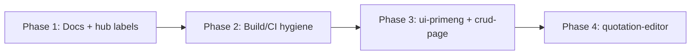

# PROJECT AUDIT & CORRECTION PLAN

**Date:** 2026-05-30  
**Repo:** `portable_kits`  
**Hub:** `schema-table-kit/demo` (`ng serve demo`)

---

## Executive Summary

`portable_kits` is a **copy-paste module warehouse**: each kit is a root-level folder whose `src/` can be copied into any consumer (KPPDF or otherwise) with path aliases and `provide*Kit()` wiring. The **schema-table-kit demo hub** is the shared dev/test shell for all kits.

**Current progress:** 9 of 15 kits have real portable `src/` code with hub demos and passing vitest (Level 3). Six remain scaffold-only (`export {}` stubs).

**Direction is correct** — monorepo-at-root, hub-driven demos, zero KPPDF imports, COPY-GUIDE per kit. Main gaps: **documentation drift**, **misleading hub labels**, **Angular prebundle/workaround debt**, **node_modules junctions**, and **6 large kits not yet ported** (ui-primeng, crud-page, quotation-editor, auth-rbac, eav, layout-shell).

---

## Principles

| # | Principle | Meaning |
|---|-----------|---------|
| P1 | **Reusability** | Kits are generic; no KPPDF types, routes, or Mongo models in `src/` |
| P2 | **No KPPDF coupling in UI** | Plain HTML/CSS v0.1 acceptable; PrimeNG via optional ui-primeng-kit skin |
| P3 | **Copy-paste kits** | Consumer copies only `kit-name/src/` + tsconfig paths + provider |
| P4 | **Hub as dev shell** | `schema-table-kit` hosts demos; kits do not depend on the hub |
| P5 | **STATUS is source of truth** | README catalog and hub badges follow each kit's STATUS.md |
| P6 | **KPPDF is a source, not owner** | INTEGRATION-KPPDF.md is backlog; no `_kits-batch`, no kppdf-only kits |

---

## Current State Matrix (15 kits)

| # | Kit | Readiness | `src/` | Hub demo | Tests | Pattern | Notes |
|---|-----|-----------|--------|----------|-------|---------|-------|
| 1 | schema-table-kit | ✅ v1 | Real | ✅ | ✅ | A | Reference implementation |
| 2 | schema-data-table-kit | ✅ v0.1 | Real | ✅ | ✅ | A | New component (not kp-table port) |
| 3 | entity-picker-kit | ✅ v0.1 | Real | ✅ | 🟡 | BD | Simplified vs KPPDF picker |
| 4 | sortable-kit | ✅ v0.1 | Real | ✅ | ✅ | B | Uses @angular/cdk/drag-drop |
| 5 | options-resolver-kit | ✅ v0.1 | Real | ✅ | ✅ | D | |
| 6 | crud-factory-kit | ✅ v0.1 | Real | ✅ | ✅ | C | Express only |
| 7 | photo-uploader-kit | ✅ v0.1 | Real | ✅ | ✅ | B | Plain HTML, no PrimeNG |
| 8 | placeholder-kit | ✅ v0.1 | Real | ✅ | ✅ | A | Subset registry |
| 9 | document-canvas-kit | ✅ v0.1 | Real | ✅ | ✅ | B | Text blocks only; tables deferred |
| 10 | crud-page-kit | 📋 scaffold | Stub | stub page | ☐ | D | Blocked on ui-primeng |
| 11 | ui-primeng-kit | 📋 scaffold | Stub | stub page | ☐ | B | 22+ KPPDF components |
| 12 | auth-rbac-kit | 📋 scaffold | Stub | stub page | ☐ | CD | Low universality |
| 13 | eav-kit | 📋 scaffold | Stub | stub page | ☐ | A | Needs entity-picker |
| 14 | quotation-editor | 📋 scaffold | Stub | stub page | ☐ | B | P0 product goal |
| 15 | layout-shell-kit | 📋 scaffold | Stub | stub page | ☐ | B | Optional ui-primeng |

**Legend:** ✅ ready · 🟡 partial · 📋 scaffold · stub page = `KitPlaceholderComponent` "В разработке"

---

## Problems Found

### P0 — Blocks correctness / misleads consumers

| ID | Problem | Impact |
|----|---------|--------|
| P0-1 | Root `README.md` catalog still lists 8 kits as 📋 scaffold when 9 are ✅ v0.1+ | Wrong onboarding; G7 in readiness checklist open |
| P0-2 | Hub home shows only binary "demo / в разработке" — no distinction ready vs stub vs scaffold | Users click scaffold kits expecting working demos |
| P0-3 | `sortable-kit` README/scaffold says "no CDK"; actual port uses `@angular/cdk/drag-drop` | Wrong dependency docs |
| P0-4 | NG0203 workaround: `angular.json` prebundle exclude + tsconfig path remaps for `@angular/*` | Fragile dev-server config; symptom of duplicate Angular bundles when compiling sibling kit sources |
| P0-5 | KPPDF-MODULES-CHECKLIST marks kits ✅ v1 while STATUS files say v0.1 | Version label inconsistency |

### P1 — Architectural / maintainability

| ID | Problem | Impact |
|----|---------|--------|
| P1-1 | Five kits have `node_modules` **junctions** → `schema-table-kit/node_modules` | Windows-only; confusing for CI/Linux; undocumented |
| P1-2 | Hub compiles all sibling kit `src/` via tsconfig paths — single Angular app bundles everything | Large demo bundle (~576 kB); every kit edit rebuilds hub |
| P1-3 | Per-kit READMEs still say "📋 scaffold — реализация не начата" for ported kits | Stale kit-level docs |
| P1-4 | Per-kit `tests/scaffold.spec.ts` placeholder tests still exist alongside hub vitest | False sense of coverage |
| P1-5 | `quotation-editor` is P0 in dependency graph but still empty scaffold | Core product goal not started |
| P1-6 | No CI (`npm test && npm run build` on push) | Regressions undetected |

### P2 — Nice to have / cleanup

| ID | Problem | Impact |
|----|---------|--------|
| P2-1 | `tools/scaffold-kits.mjs` generates stale STATUS/README; `kppdfOnly` field unused | Regenerated scaffolds would mislead |
| P2-2 | `placeholder-kit/src/express/` is empty stub; barrel no longer exports express | Pattern A incomplete |
| P2-3 | No isolated `npm start` per kit (only hub) | Harder to develop kits independently |
| P2-4 | entity-picker tests marked 🟡 in readiness doc | Coverage gap |
| P2-5 | INTEGRATION-KPPDF.md files are identical boilerplate across kits | Low value until kit is ready |

---

## Correction Actions

### Phase 1 — Quick wins (docs + hub honesty) ✅ in progress

- [x] **C1** Update root `README.md` catalog to match 9 ready + 6 scaffold
- [x] **C2** Add `readiness` field to `modules.config.ts` (`ready` | `stub` | `scaffold`)
- [x] **C3** Hub home badges: «Готово» / «Заглушка» / «Scaffold» instead of binary
- [x] **C4** Fix sortable-kit description in `modules.config.ts` (CDK drag-drop)
- [x] **C5** Align KPPDF-MODULES-CHECKLIST v0.1 labels with STATUS files
- [x] **C6** Mark G7 done in KITS-READINESS-CHECKLIST.md
- [x] **C7** Create this audit document

### Phase 2 — Hub & build hygiene

- [ ] **C8** Document node_modules junction pattern in HOW-TO-ADD-KIT or hub README
- [ ] **C9** Replace junctions with documented `npm install` in hub-only workflow OR npm workspaces
- [ ] **C10** Investigate proper fix for NG0203 (single Angular resolution) vs prebundle exclude
- [ ] **C11** Add GitHub Actions: `cd schema-table-kit && npm test && npm run build`
- [ ] **C12** Update ported kits' README.md status lines from scaffold template

### Phase 3 — Port next blocking kits

- [ ] **C13** ui-primeng-kit v0.1 — KpButton, KpInput, KpDialog (minimal)
- [ ] **C14** document-canvas-kit v0.2 — table/separator blocks
- [ ] **C15** crud-page-kit v0.1 — CrudStore + generic list page
- [ ] **C16** entity-picker multi-select (unblocks quotation-editor)

### Phase 4 — Product completion

- [ ] **C17** quotation-editor v0.1 — compose canvas + placeholder + entity picker
- [ ] **C18** layout-shell-kit v0.1
- [ ] **C19** eav-kit v0.1
- [ ] **C20** auth-rbac-kit v0.1 (optional / low priority)
- [ ] **C21** Per-kit isolated demos where hub is insufficient
- [ ] **C22** KPPDF integration pass (INTEGRATION-KPPDF.md per ready kit)

---

## Execution Phases (ordered)

1. **Phase 1** — Honest docs and hub UI (this session)
2. **Phase 2** — CI, junction docs, Angular bundle fix, README sweep
3. **Phase 3** — ui-primeng → crud-page → document-canvas v0.2
4. **Phase 4** — quotation-editor + layout + eav + KPPDF cutover

---

## Definition of Done (whole project)

| # | Criterion |
|---|-----------|
| D1 | All 15 kits have real `src/` (no `export {}` stubs) OR explicitly marked deprecated/removed |
| D2 | Each kit: STATUS ✅, hub demo OR documented standalone demo, vitest green |
| D3 | Root README + KPPDF-MODULES-CHECKLIST + KITS-READINESS match STATUS files |
| D4 | Hub home shows accurate readiness per kit |
| D5 | `cd schema-table-kit && npm test && npm run build` green in CI |
| D6 | Zero imports from `kppdf-3.0` in any kit `src/` |
| D7 | COPY-GUIDE + QUICKSTART accurate for each kit's public API |
| D8 | quotation-editor demo composes document-canvas + placeholder + entity-picker |
| D9 | Optional: KPPDF consumer can copy any ready kit per COPY-GUIDE without hub |
| D10 | No `_kits-batch`, no kppdf-only kit category, no misleading "v1" on partial ports |

---

## Related Docs

- [KITS-READINESS-CHECKLIST.md](./KITS-READINESS-CHECKLIST.md) — Level 3 per-kit checklist
- [KPPDF-MODULES-CHECKLIST.md](./KPPDF-MODULES-CHECKLIST.md) — Module inventory
- [HOW-TO-ADD-KIT.md](./HOW-TO-ADD-KIT.md) — New kit workflow
