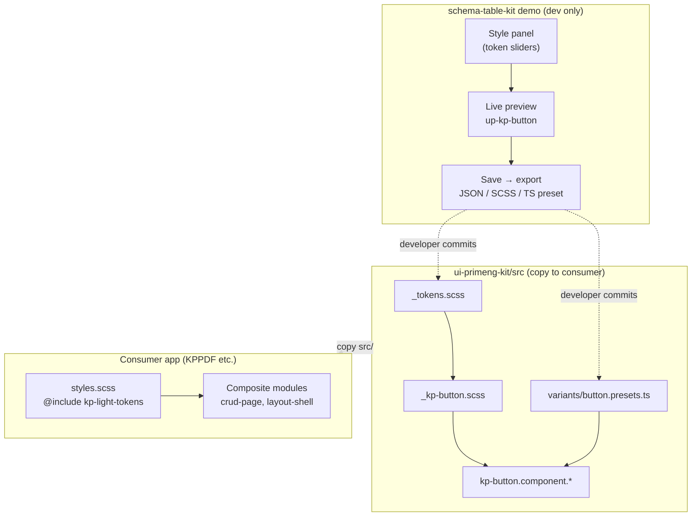

# Audit: visual customization of ui-primeng-kit

> **Date:** 2026-05-30  
> **Status:** vision / architectural guidance (no implementation)  
> **Scope:** `ui-primeng-kit`, demo-hub `schema-table-kit`, portable kits model

---

## 1. User vision (recorded as requirements)

| # | Wish |
|---|------|
| V1 | On the **button** demo page — a **side panel** (left or right) for configuring/styling buttons via **CSS or SCSS** |
| V2 | After visual configuration — a **"Save"** action → result becomes an **approved ui-kit variant** ("approved variant") |
| V3 | Question: **how to persist** settings — database, CSS files, structured format? |
| V4 | **End state:** one styles folder for small UI bricks (buttons, etc.) that **loads** together with larger composite modules when imported |
| V5 | Doubt: **is this how it's done** in the industry, or is it better to edit code directly without overcomplicating? |

### Terminology clarification

The user mentioned "**jQuery folder**" — most likely referring to a **CSS/UI-kit styles folder** (design tokens, SCSS mixins, variant presets), not the jQuery library. portable_kits does not use jQuery; styling is **SCSS + CSS custom properties**.

---

## 2. Current state (as-is)

### 2.1 Portable kits model

Per [HOW-TO-ADD-KIT.md](./HOW-TO-ADD-KIT.md):

- Consumer **copies only `src/`** of the kit into their project (copy-paste, not npm package).
- Kit is **autonomous**, does not import consumer (KPPDF, etc.).
- Demo and tests live in hub `schema-table-kit`; demo is **not** copied to consumer.

`ui-primeng-kit` — **pattern B**: copy `ui-primeng-kit/src/` → `packages/ui-primeng-kit/src/`.

### 2.2 Styles ui-primeng-kit today

```
ui-primeng-kit/src/angular/
├── styles/
│   ├── _tokens.scss      ← CSS variables (--kp-primary, --kp-button-*)
│   ├── _kp-button.scss   ← SCSS variant mixins (premium/flat × severity)
│   └── _kp-field.scss
├── kp-button.component.ts
└── kp-button.component.scss  ← @use './styles/kp-button'; applies mixins by host classes
```

**Tokens** (`_tokens.scss`):

- Mixin `kp-light-tokens` defines design tokens as CSS custom properties.
- In demo-hub, included globally:

```scss
// schema-table-kit/demo/styles.scss
@use '../../ui-primeng-kit/src/angular/styles/tokens' as upTokens;
@include upTokens.kp-light-tokens-on-root;
```

**KpButton** (`kp-button.component.ts`):

- Inputs: `variant` (`premium` | `flat`), `severity`, `size`, PrimeNG modifiers (`outlined`, `text`, …).
- HostBinding classes: `up-kp-button--variant-*`, `up-kp-button--severity-*`.
- Variant styles in SCSS mixins, **not** runtime config.

**provideUiPrimengKit()**:

- Minimal DI provider; `UiPrimengKitConfig` reserved (`cssPrefix?`).
- Theme override helper — marked as "Next" in [STATUS.md](../ui-primeng-kit/STATUS.md).

### 2.3 Button demo today

- Route: `/modules/ui-primeng-kit/button`
- Static showcase of all severity / variant / modifier combinations.
- **No** side panel, **no** live CSS editor, **no** Save/export.

### 2.4 Style loading in composite modules

Currently composite kits (crud-page-kit, layout-shell-kit, etc.) **do not yet import** ui-primeng-kit directly in the repo. Hub demo includes the kit globally via `app.config.ts` + `styles.scss`.

When integrated into consumer:

| What | How |
|------|-----|
| `<up-kp-button>` component | TypeScript import from `@ui-primeng-kit/angular` |
| Component styles | Angular **bundles** `styleUrl` of each kp-* automatically |
| Global tokens | Consumer once: `@include kp-light-tokens-on-root` in `styles.scss` |
| PrimeNG base | `providePrimeNG({ theme: { preset: Aura } })` + primeicons CSS |

**No** separate server-side styles folder that loads at runtime — everything is **build-time bundled**.

---

## 3. Architectural correction and recommendations

### 3.1 Answer to V5: "is this how it's done, or edit code directly?"

**Both approaches coexist**, but for different roles:

| Role | Standard approach |
|------|------------------|
| **Dev team**, establishing design system | Git + SCSS tokens + code review. Edits to `_tokens.scss`, `_kp-button.scss`, presets in TS. |
| **Designer / PM**, exploring variants before commit | Visual playground in **demo** (hub), no production persistence. |
| **End users of SaaS**, changing theme in product | DB / CMS / theme API — **a different product**, not portable_kits. |

For **portable_kits**, the source of truth is **the repository (git)**, not a database.

### 3.2 Answer to V3: DB vs files vs design tokens

| Option | Suitable for portable_kits? | Comment |
|--------|----------------------------|---------|
| **Database** | ❌ No (for kit model) | Needed only if building a SaaS theme editor for end-users. Adds runtime dependency, complicates copy-paste kit portability. |
| **Separate CSS files "as is"** | ⚠️ Partially | Poor versioning, duplicates mixin logic, no connection to TS API (`variant`, `severity`). |
| **Design tokens (SCSS + CSS vars)** | ✅ Yes | Already implemented in `_tokens.scss`. Consumer overrides `--kp-*` or forks mixin. |
| **Structured presets (JSON/TS + generated SCSS)** | ✅ Yes (v0.3+) | Demo "Save" exports artifact → developer inserts into repo and commits. |

**Recommendation:** persistence = **files in git** (tokens, presets, variant map). Demo may use **localStorage** only for session drafts, not as production mechanism.

### 3.3 Answer to V4: "one styles folder for bricks"

Vision **correct in concept**, but mechanism differs:

```
ui-primeng-kit/src/angular/styles/   ← "bricks folder" (already exists)
├── _tokens.scss                       ← common tokens
├── _kp-button.scss                    ← "button" brick
├── _kp-field.scss                     ← "field" brick
└── (future _kp-*.scss)
```

**Composite kit** (e.g., crud-page-kit) when using kp-components:

1. Imports `<up-kp-button>` in TS.
2. Includes tokens in **global** `styles.scss` of consumer (once).
3. Styles of each kp-* **travel in bundle** via Angular component styles.

No separate HTTP request or dynamic CSS-folder import needed — **build-time bundling**.

### 3.4 "Approved button variant" pattern (V2)

Recommended **variant registry**:

```
ui-primeng-kit/src/
├── core/
│   └── button-variants.types.ts     ← KpButtonVariantConfig, id, label, default inputs
├── angular/
│   ├── styles/
│   │   ├── _tokens.scss
│   │   └── _kp-button.scss
│   └── variants/
│       └── button.presets.ts        ← APPROVED_VARIANTS: Record<string, KpButtonVariantConfig>
```

**Workflow:**

1. Demo panel changes CSS vars / token overrides → **live preview** on `<up-kp-button>`.
2. "Save" → generates:
   - **JSON** token overrides (`{ "--kp-primary": "#..." }`), and/or
   - **SCSS snippet** for `_tokens.scss` / consumer override file, and/or
   - **TS preset** for `button.presets.ts`.
3. Developer **copies to clipboard** or (dev-only) writes file → **git commit** = "confirmed".

"Confirmed" = **entry in the repository**, reviewed via PR, not a flag in DB.

### 3.5 Visual builder in demo — not overkill, but with boundaries

| ✅ Makes sense | ❌ Overkill for portable_kits |
|---------------|------------------------------|
| Side panel on demo **only in hub** | Full WYSIWYG with production DB writes |
| Editing **token overrides** (colors, radius, padding) | Arbitrary raw CSS without token system connection |
| Preview all severity × variant | Drag-and-drop layout builder |
| Export → clipboard / template file | Auto-write to repo without review (CI should not write to git from browser) |

**Primary consumer customization path** remains: fork `_tokens.scss` or override CSS vars in `:root` — **without demo panel**.

Demo panel — **exploration and documentation tool**, not runtime configurator.

---

## 4. Target architecture (to-be) for monorepo



### Principles

1. **Single source of truth** — git, SCSS tokens, typed presets.
2. **Demo ≠ prod** — playground not required to live in consumer copy.
3. **No KPPDF coupling** — export format universal; consumer decides where to insert snippet.
4. **Extensibility** — same pattern for input, dialog, future kp-*.

### Consumer COPY-GUIDE (future version supplement)

```scss
// consumer styles.scss
@use 'packages/ui-primeng-kit/src/angular/styles/tokens' as kp;
@include kp.kp-light-tokens-on-root;

// optional: override
:root {
  --kp-primary: #your-brand;
}
```

```typescript
// app.config.ts
providePrimeNG({ theme: { preset: Aura, ... } }),
provideUiPrimengKit({ /* future: defaultVariant, tokenOverrides */ }),
```

---

## 5. Roadmap (phased)

### v0.1 — ✅ current

- KpButton / KpInput / KpDialog
- Tokens + SCSS mixins
- Static demo catalog

### v0.2 — Demo playground (no repo persistence)

- [ ] Layout button demo page: **preview left / panel right** (or vice versa)
- [ ] Panel: sliders/color pickers for `--kp-primary`, `--kp-button-border-radius`, padding, shadow toggles
- [ ] Live binding via `[style.--kp-primary]` on wrapper or `:host` context
- [ ] Draft in **sessionStorage / localStorage** (optional)
- [ ] "Reset to defaults" button

**Not in v0.2:** file writes to disk, API, DB.

### v0.3 — Export artifacts

- [ ] "Save / Export" → modal with three tabs: **JSON tokens**, **SCSS snippet**, **TS preset**
- [ ] Copy to clipboard
- [ ] Add `core/button-variants.types.ts` + `variants/button.presets.ts` with 2–3 approved examples
- [ ] Document in COPY-GUIDE: how consumer applies export

### v0.4 — Optional persistence (only if needed)

- [ ] Dev-server endpoint `POST /api/ui-kit/drafts` — **local dev only**, gitignored
- [ ] Or import JSON preset from file into demo panel
- [ ] **Not** adding to production consumer path

### v1.0 — Composite integration

- [ ] crud-page-kit / layout-shell-kit use `<up-kp-button>` + documented token setup
- [ ] `provideUiPrimengKit({ tokenOverrides })` — runtime CSS vars injection (if white-label needed without rebuild)

---

## 6. Risks and anti-patterns

| Risk | Mitigation |
|------|-----------|
| Demo panel becomes the only customization method | Document direct `_tokens.scss` editing as primary path |
| Raw CSS in panel bypasses token system | Panel only edits whitelist `--kp-*` keys |
| "Save" writes to repo from browser | Only export + manual commit |
| Style duplication between kits | Common tokens in ui-primeng-kit; composite kits do not fork button SCSS |
| DB for themes in copy-paste kit | Explicitly out of scope; separate product |

---

## 7. Summary for decision making

| Question | Answer |
|----------|--------|
| Build side panel? | **Yes**, in demo hub — as playground, not prod-config |
| DB for styles? | **No** for portable_kits |
| Where to "Save"? | **Export → git** (tokens / presets / SCSS snippet) |
| "Bricks folder"? | Already **`src/angular/styles/`**; composite kits pull via import + build bundle |
| Edit code directly? | **Yes**, primary path; panel accelerates experiments and preset capture |

---

## Related documents

- [USER-WISHES-CHECKLIST.md](./USER-WISHES-CHECKLIST.md) — user wishes summary (discussion checklist)
- [HOW-TO-ADD-KIT.md](./HOW-TO-ADD-KIT.md) — portable kits model
- [ui-primeng-kit/STATUS.md](../ui-primeng-kit/STATUS.md) — current kit status
- [ui-primeng-kit/COPY-GUIDE.md](../ui-primeng-kit/COPY-GUIDE.md) — port to consumer
- [ui-primeng-kit/README.md](../ui-primeng-kit/README.md) — public API
