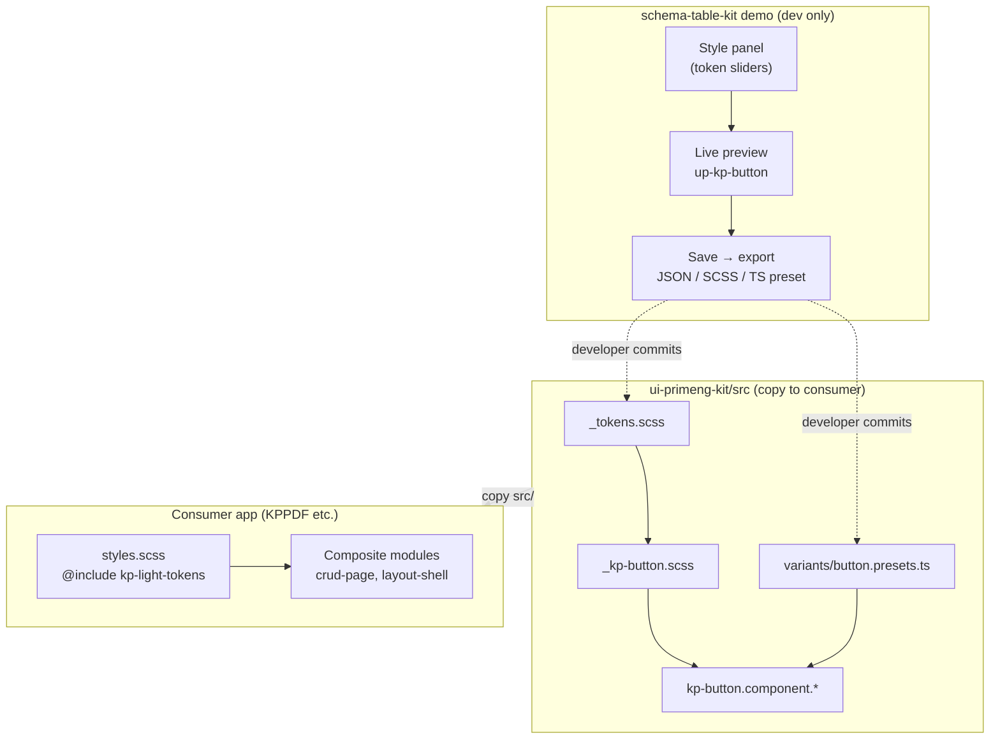

# Аудит: визуальная кастомизация ui-primeng-kit

> **Дата:** 2026-05-30  
> **Статус:** vision / architectural guidance (без реализации)  
> **Область:** `ui-primeng-kit`, demo-hub `schema-table-kit`, модель portable kits

---

## 1. Видение пользователя (зафиксировано как требования)

| # | Пожелание |
|---|-----------|
| V1 | На demo-странице кнопки — **боковая панель** (слева или справа) для настройки/стилизации кнопок через **CSS или SCSS** |
| V2 | После визуальной настройки — действие **«Сохранить»** → результат становится **подтверждённым вариантом ui-kit** («approved variant») |
| V3 | Вопрос: **как персистить** настройки — база данных, CSS-файлы, структурированный формат? |
| V4 | **Конечное состояние:** одна папка со стилями для мелких UI-кирпичей (кнопки и т.д.), которая **подгружается** вместе с более крупными составными модулями при их импорте |
| V5 | Сомнение: **так ли это делают** в индустрии, или лучше править код напрямую и не усложнять? |

### Уточнение терминологии

Пользователь упоминал «**jQuery-папку**» — скорее всего имелась в виду **папка CSS/UI-kit стилей** (design tokens, SCSS-миксины, пресеты вариантов), а не библиотека jQuery. В portable_kits jQuery не используется; стилизация — **SCSS + CSS custom properties**.

---

## 2. Текущее состояние (as-is)

### 2.1 Модель portable kits

Согласно [HOW-TO-ADD-KIT.md](./HOW-TO-ADD-KIT.md):

- Consumer **копирует только `src/`** kit-а в свой проект (copy-paste, не npm-пакет).
- Kit **автономен**, не импортирует consumer (KPPDF и т.п.).
- Demo и тесты живут в hub `schema-table-kit`; в consumer demo **не переносится**.

`ui-primeng-kit` — **паттерн B**: копируется `ui-primeng-kit/src/` → `packages/ui-primeng-kit/src/`.

### 2.2 Стили ui-primeng-kit сегодня

```
ui-primeng-kit/src/angular/
├── styles/
│   ├── _tokens.scss      ← CSS-переменные (--kp-primary, --kp-button-*)
│   ├── _kp-button.scss   ← SCSS-миксины вариантов (premium/flat × severity)
│   └── _kp-field.scss
├── kp-button.component.ts
└── kp-button.component.scss  ← @use './styles/kp-button'; применяет миксины по host-классам
```

**Токены** (`_tokens.scss`):

- Mixin `kp-light-tokens` задаёт design tokens как CSS custom properties.
- В demo-hub подключаются глобально:

```scss
// schema-table-kit/demo/styles.scss
@use '../../ui-primeng-kit/src/angular/styles/tokens' as upTokens;
@include upTokens.kp-light-tokens-on-root;
```

**KpButton** (`kp-button.component.ts`):

- Inputs: `variant` (`premium` | `flat`), `severity`, `size`, модификаторы PrimeNG (`outlined`, `text`, …).
- HostBinding-классы: `up-kp-button--variant-*`, `up-kp-button--severity-*`.
- Стили вариантов — в SCSS через миксины, **не** через runtime-конфиг.

**provideUiPrimengKit()**:

- Минимальный DI-провайдер; `UiPrimengKitConfig` зарезервирован (`cssPrefix?`).
- Theme override helper — в [STATUS.md](../ui-primeng-kit/STATUS.md) помечен как «Next».

### 2.3 Demo кнопки сегодня

- Маршрут: `/modules/ui-primeng-kit/button`
- Статичная витрина всех комбинаций severity / variant / modifiers.
- **Нет** боковой панели, **нет** live-редактора CSS, **нет** Save/export.

### 2.4 Загрузка стилей в составных модулях

Сейчас composite kits (crud-page-kit, layout-shell-kit и др.) **ещё не импортируют** ui-primeng-kit напрямую в коде repo. Hub demo подключает kit глобально через `app.config.ts` + `styles.scss`.

При интеграции в consumer:

| Что | Как |
|-----|-----|
| Компонент `<up-kp-button>` | TypeScript import из `@ui-primeng-kit/angular` |
| Стили компонента | Angular **бандлит** `styleUrl` каждого kp-* автоматически |
| Глобальные токены | Consumer один раз: `@include kp-light-tokens-on-root` в `styles.scss` |
| PrimeNG base | `providePrimeNG({ theme: { preset: Aura } })` + primeicons CSS |

**Не** требуется отдельная «папка на сервере», которая подгружается runtime — всё собирается **на этапе build**.

---

## 3. Архитектурная коррекция и рекомендации

### 3.1 Ответ на V5: «так делают или правят код?»

**Оба подхода сосуществуют**, но для разных ролей:

| Роль | Стандартный путь |
|------|------------------|
| **Команда разработки**, фиксирует design system | Git + SCSS tokens + code review. Правки в `_tokens.scss`, `_kp-button.scss`, presets в TS. |
| **Дизайнер / PM**, исследует варианты до коммита | Visual playground в **demo** (hub), без персистенции в prod. |
| **Конечные пользователи SaaS**, меняют тему в продукте | БД / CMS / theme API — **другой продукт**, не portable_kits. |

Для **portable_kits** источник истины — **репозиторий (git)**, не БД.

### 3.2 Ответ на V3: БД vs файлы vs design tokens

| Вариант | Подходит для portable_kits? | Комментарий |
|---------|----------------------------|-------------|
| **База данных** | ❌ Нет (для kit-модели) | Нужна только если строите SaaS theme editor для end-users. Добавляет runtime-зависимость, усложняет copy-paste перенос kit. |
| **Отдельные CSS-файлы «как есть»** | ⚠️ Частично | Плохо версионируются, дублируют логику миксинов, нет связи с TS API (`variant`, `severity`). |
| **Design tokens (SCSS + CSS vars)** | ✅ Да | Уже реализовано в `_tokens.scss`. Consumer переопределяет `--kp-*` или форкает mixin. |
| **Structured presets (JSON/TS + generated SCSS)** | ✅ Да (v0.3+) | Demo «Save» экспортирует артеfact → разработчик вставляет в repo и коммитит. |

**Рекомендация:** персистенция = **файлы в git** (tokens, presets, variant map). Demo может использовать **localStorage** только для черновика сессии, не как prod-механизм.

### 3.3 Ответ на V4: «одна папка стилей для кирпичей»

Видение **верное по смыслу**, но механизм другой:

```
ui-primeng-kit/src/angular/styles/   ← «папка кирпичей» (уже есть)
├── _tokens.scss                       ← общие токены
├── _kp-button.scss                    ← кирпич «кнопка»
├── _kp-field.scss                     ← кирпич «поле»
└── (будущие _kp-*.scss)
```

**Composite kit** (например, crud-page-kit) при использовании kp-компонентов:

1. Импортирует `<up-kp-button>` в TS.
2. Подключает токены в **глобальном** `styles.scss` consumer (один раз).
3. Стили каждого kp-* **едут в bundle** через Angular component styles.

Не нужен отдельный HTTP-запрос или динамический import CSS-папки — **build-time bundling**.

### 3.4 Паттерн «подтверждённый вариант кнопки» (V2)

Рекомендуемая схема **variant registry**:

```
ui-primeng-kit/src/
├── core/
│   └── button-variants.types.ts     ← KpButtonVariantConfig, id, label, default inputs
├── angular/
│   ├── styles/
│   │   ├── _tokens.scss
│   │   └── _kp-button.scss
│   └── variants/
│       └── button.presets.ts        ← APPROVED_VARIANTS: Record<string, KpButtonVariantConfig>
```

**Workflow:**

1. Demo panel меняет CSS vars / token overrides → **live preview** на `<up-kp-button>`.
2. «Save» → генерирует:
   - **JSON** token overrides (`{ "--kp-primary": "#..." }`), и/или
   - **SCSS snippet** для `_tokens.scss` / consumer override file, и/или
   - **TS preset** для `button.presets.ts`.
3. Разработчик **копирует в clipboard** или (dev-only) пишет файл → **git commit** = «confirmed».

«Confirmed» = **запись в репозитории**, прошедшая review, а не флаг в БД.

### 3.5 Visual builder в demo — не overkill, но с границами

| ✅ Имеет смысл | ❌ Overkill для portable_kits |
|---------------|------------------------------|
| Боковая панель на demo **только в hub** | Полноценный WYSIWYG с записью в prod БД |
| Редактирование **token overrides** (цвета, radius, padding) | Произвольный raw CSS без привязки к tokens |
| Preview всех severity × variant | Drag-and-drop layout builder |
| Export → clipboard / файл-шаблон | Auto-write в repo без review (CI не должен писать в git из браузера) |

**Основной путь кастомизации для consumer** остаётся: форк `_tokens.scss` или override CSS vars в `:root` — **без demo panel**.

Demo panel — **инструмент исследования и документирования**, не runtime-конфигуратор.

---

## 4. Целевая архитектура (to-be) для monorepo



### Принципы

1. **Single source of truth** — git, SCSS tokens, typed presets.
2. **Demo ≠ prod** — playground не обязан жить в consumer copy.
3. **No KPPDF coupling** — export format универсален; consumer сам решает, куда вставить snippet.
4. **Расширяемость** — тот же паттерн для input, dialog, future kp-*.

### Consumer COPY-GUIDE (дополнение к будущим версиям)

```scss
// consumer styles.scss
@use 'packages/ui-primeng-kit/src/angular/styles/tokens' as kp;
@include kp.kp-light-tokens-on-root;

// опционально: override
:root {
  --kp-primary: #your-brand;
}
```

```typescript
// app.config.ts
providePrimeNG({ theme: { preset: Aura, ... } }),
provideUiPrimengKit({ /* future: defaultVariant, tokenOverrides */ }),
```

---

## 5. Дорожная карта (phased)

### v0.1 — ✅ сейчас

- KpButton / KpInput / KpDialog
- Tokens + SCSS mixins
- Статичный demo catalog

### v0.2 — Demo playground (без персистенции в repo)

- [ ] Layout demo-страницы кнопки: **preview слева / panel справа** (или наоборот)
- [ ] Panel: sliders/color pickers для `--kp-primary`, `--kp-button-border-radius`, padding, shadow toggles
- [ ] Live binding через `[style.--kp-primary]` на wrapper или `:host` context
- [ ] Черновик в **sessionStorage / localStorage** (опционально)
- [ ] Кнопка «Reset to defaults»

**Не делать в v0.2:** запись файлов на диск, API, БД.

### v0.3 — Export артеfactов

- [ ] «Save / Export» → modal с тремя вкладками: **JSON tokens**, **SCSS snippet**, **TS preset**
- [ ] Copy to clipboard
- [ ] Добавить `core/button-variants.types.ts` + `variants/button.presets.ts` с 2–3 approved примерами
- [ ] Документировать в COPY-GUIDE: как consumer применяет export

### v0.4 — Optional persistence (только если нужно)

- [ ] Dev-server endpoint `POST /api/ui-kit/drafts` — **только local dev**, gitignored
- [ ] Или import JSON preset из файла в demo panel
- [ ] **Не** добавлять в production consumer path

### v1.0 — Composite integration

- [ ] crud-page-kit / layout-shell-kit используют `<up-kp-button>` + documented token setup
- [ ] `provideUiPrimengKit({ tokenOverrides })` — runtime CSS vars injection (если нужен white-label без rebuild)

---

## 6. Риски и anti-patterns

| Риск | Митигация |
|------|-----------|
| Demo panel становится единственным способом настройки | Документировать прямое редактирование `_tokens.scss` как primary path |
| Raw CSS в panel обходит token system | Panel редактирует только whitelist `--kp-*` keys |
| «Save» пишет в repo из браузера | Только export + manual commit |
| Дублирование стилей между kits | Общие tokens в ui-primeng-kit; composite kits не форкают button SCSS |
| БД для тем в copy-paste kit | Явно out of scope; отдельный продукт |

---

## 7. Краткий вывод для принятия решения

| Вопрос | Ответ |
|--------|-------|
| Делать боковую панель? | **Да**, в demo hub — как playground, не как prod-config |
| БД для стилей? | **Нет** для portable_kits |
| Куда «Save»? | **Export → git** (tokens / presets / SCSS snippet) |
| «Папка кирпичей»? | Уже **`src/angular/styles/`**; composite kits тянут через import + build bundle |
| Править код напрямую? | **Да**, это основной путь; panel ускоряет эксперименты и фиксацию presets |

---

## Связанные документы

- [USER-WISHES-CHECKLIST.md](./USER-WISHES-CHECKLIST.md) — свод пожеланий пользователя (чек-лист для обсуждения)
- [HOW-TO-ADD-KIT.md](./HOW-TO-ADD-KIT.md) — модель portable kits
- [ui-primeng-kit/STATUS.md](../ui-primeng-kit/STATUS.md) — текущий статус kit
- [ui-primeng-kit/COPY-GUIDE.md](../ui-primeng-kit/COPY-GUIDE.md) — перенос в consumer
- [ui-primeng-kit/README.md](../ui-primeng-kit/README.md) — public API
